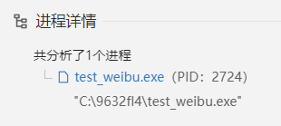
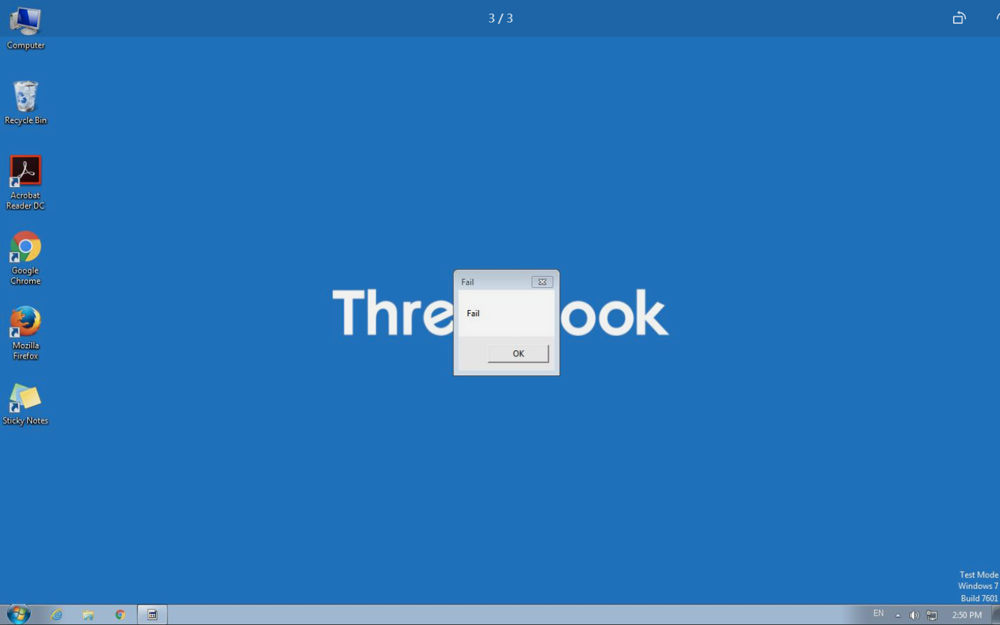

# 反沙箱杂谈

> 作者：余吉

# 导语

笔者学习免杀时遇到了个无法绕过的难题，那就是反沙箱，当我们的样本被上传到在线分析网站，我们的样本将会受到动态和静态的分析，并且运行在一个虚拟化的系统当中，记录样本的敏感操作从而判定此样本是否为恶意程序。我们也许都遇到过，CS上线了许多国外的机器，不同的用户名，不同的系统，但心跳包保持较短，此时我们就可以认定为我们的样本已经陷入沙箱环境了。我们该怎么做呢？不妨听听笔者的反沙箱杂谈从而进一步研究。

# 沙箱

在我们讨论反沙箱之前，让我们先弄清楚什么是沙箱。[NIST](https://csrc.nist.gov/glossary/term/sandbox)将沙箱定义为“允许不受信任的应用程序在高度受控的环境中运行的系统，其中应用程序的权限被限制为一组基本的计算机权限”

沙箱其实可以分为软件，硬件，云上，三个方向。

软件常见的有[sandboxie](https://sandboxie-plus.com/downloads/) 用于沙箱中启动程序，VMware和Docker也算软件的沙箱实现

硬件的比较少一般都作为企业解决方法来出售例如华为的[FireHunter6000](https://e.huawei.com/cn/products/security/firehunter6000)

云上的就是我们常用的沙箱网站了例如：

* https://s.threatbook.com/ 微步沙箱
* https://www.virustotal.com/ VT
* https://any.run/ 可交互式的沙箱
* https://www.joesandbox.com/#windows joe沙箱
* https://www.hybrid-analysis.com/ hybrid分析系统
* https://sandbox.dbappsecurity.com.cn/ 安恒云沙箱
* https://sandbox.ti.qianxin.com/sandbox/page 奇安信沙箱
* https://sandbox.freebuf.com/ freebuf沙箱
* https://ata.360.net/ 360云沙箱
* https://habo.qq.com/ 哈勃沙箱

# 前提

如果你想给自己的木马样本做反沙箱，那请确保 以下前提:

* 能够静态免杀

  * 确保静态资源中无任何敏感信息，尽量不加壳
  * 若以shellcode形式加载，请将shellcode提前加密（避免使用对称加密短密钥）
* 无其他前置执行条件

  * 例如在加载逻辑之前进行了反调试判断等
  * 确保程序执行时首先调用了反沙箱逻辑

  笔者使用Visual Studio 2019编程语言为C++，读者若有其他喜好可自行更换IDE或编程语言

# 思路

## 开胃小菜

如何反微步沙箱？

先看一下微步的释放功能，C盘下生成一个随机字符串文件夹来运行



此时我们就可以编写代码，利用简单的正则表达式匹配从而反沙箱

```cpp
std::string workingdir()
{
    char buf[256];
    GetCurrentDirectoryA(256, buf);
    return std::string(buf);
}
bool check_run_path() {
    std::string test(workingdir());
    std::regex pattern("^C:\\\\[A-Za-z0-9_]+");
    if (std::regex_match(test, pattern)) {
        return false;
    }
    else {
        return true;
    }
}
```

成果

  微步多年以来都是这样释放样本的，理论上不会失效。接下来会以三个反向介绍反沙箱的思路

## 时间判断

用于延迟，由于沙箱会对进程加速，或者hook等手段绕过时间延迟，我们最好搭配差值判断使用

延迟的时间最好长一点，因为有的虚拟机分析时间可以很长

常规

* NtDelayExecution
* WaitForSingleObject
* SetTimer
* SetWaitableTimer
* CreateTimerQueueTimer

进阶

* 使用API Flooding（API泛洪）
* GetSystemTimeAdjustment
* 自己实现一个定时
  * 实现定时函数
  * 使用求算法延时
* 从另一个进程获取时间 例如计划任务
* select (Windows sockets)

配合

* 联网查询时间戳判断差值
  * NTP
  * 第三方api

我使用的

* 时间延迟和差值判断

```cpp
bool check_time() {
    auto url = ("http://api.pinduoduo.com");
    httplib::Client cli(url);
    auto res = cli.Get("/api/server/_stm");
    std::string time_str1;
    if (res->status == 200) {
        for (char c : res->body) {
            if (c >= '0' && c <= '9') {
                time_str1 += c;
            }
        }
    }
    else {
        return false;
    }
    long long api_time1 = std::stoll(time_str1);
    time_t currentTime1 = time(0);
    //开始休眠300秒
    HANDLE hEvent = CreateEvent(NULL, TRUE, FALSE, NULL);
    WaitForSingleObject(hEvent, 300000);//300s
    CloseHandle(hEvent);
    res = cli.Get("/api/server/_stm");
    std::string time_str2;
    if (res->status == 200) {
        for (char c : res->body) {
            if (c >= '0' && c <= '9') {
                time_str2 += c;
            }
        }
    }
    else {
        return false;
    }
    long long api_time2 = std::stoll(time_str2);
    //判断差值
    if (api_time2 - api_time1 > 290000) {
        return true;
    }
    else {
        exit(0);
        return false;
    }
}
```

用于判断系统启动时间，一般虚拟机是一直持续运行运行时间可能很长我们可以用WINAPI GetTickCount()来判断

但是，如果我们的样本目标是对服务器进行测试的话，判断系统启动时间就不有效了

## 因素判断

常规

+ 判断CPU核心数 dwNumberOfProcessors
+ 判断RAM大小 GlobalMemoryStatus
+ 判断硬盘大小 PhysicalDrive0
+ 判断系统用户名
  + 以前有判断用户名的字典，现在一般都是DESKTOP-XXX随机的数字
+ 判断工作组（域）

进阶，这部分有一个专业的术语 **Pocket Litter**

+ 判断桌面上文件
  + 大多数沙箱桌面文件数量很少，且有各种office软件，但没有微信QQ之类的软件
  + 我们可以判断怎么文件数量小于某一个范围从而判断是否在沙箱
  + 判断桌面上有没有微信QQ企业微信，等符合国人常规习惯软件
+ 判断临时文件数量
  + 相反，临时文件比一般正常用户多也可以判断为是沙箱
+ 判断系统内有多少doc,xls,ppt类文件
  + 较少的都可能为沙箱
+ 判断自身文件名有没有被修改
+ 判断自身进程是否运行在一个时间范围内（apt常用，hvv常用）
+ 判断系统语言 GetSystemDefaultLangID
  + 俄罗斯APT常用手段，判断为俄语就退出进程
+ 判断自身被附加的dll制作黑名单
+ 判断ip
  + 按照目标来判断
  + 例如我们目标是国内，就判断是否非国内ip，从而反制国外沙箱
  + 或者范围缩小到地级市
+ 判断扬声器是否正常可调用
+ 判断麦克风是否有响应
+ 判断当前前台窗口数量
  + 虚拟机一般都较少
+ 判断鼠标是否移动
  + 之前很火的方法GetCursorPos
  + 获取坐标后延迟两次 获取向量 看结果是否为一个类三角形若真则不是沙箱
  + 因为在ATT&CK框架中被标识 所以列入敏感行为
+ 判断显卡显存大小
  + 一般家用机都为2gb以上，而沙箱不会给这么多
+ 判断系统变量
  + 一般判断是否有虚拟机相关文件的环境变量
+ 判断CPU温度

注意一下，建议使用GetSystemFirmwareTable api 获取SMBIOS中的硬件信息

使用wmi api将会变成敏感行为

我使用的

+ ip检测

```cpp
bool check_ip() {
    auto url = "http://ip-api.com";
    httplib::Client cli(url);
    auto res = cli.Get("/csv");
    std::string ip_str;
    if (res->status == 200) {
        for (char c : res->body) {
            ip_str += c;
        }
    }
    else {
        exit(0);
        return false;
    }
    if (ip_str.find("China") != std::string::npos) {
        //std::cout << "The string contains 'China'." << std::endl;
        return true;
    }
    else {
        //std::cout << "The string does not contain 'China'." << std::endl;
        exit(0);
        return false;
    }
}
```

+ 鼠标检测

```cpp
double distance(POINT p1, POINT p2) {
    double dx = p2.x - p1.x;
    double dy = p2.y - p1.y;
    return sqrt(dx * dx + dy * dy);
}
bool check_mouse() {
    POINT p1, p2, p3;
    GetCursorPos(&p1);
    Sleep(3000);
    GetCursorPos(&p2);
    Sleep(3000); 
    GetCursorPos(&p3);
    double d1 = distance(p1, p2);
    double d2 = distance(p2, p3);
    double d3 = distance(p3, p1);
    // 检查是否能构成一个类三角形
    if ((d1 + d2 > d3) && (d2 + d3 > d1) && (d1 + d3 > d2)) {
        return true;
    }
    else {
        return false;
    }
}
```


## 歪门邪道

还有其他奇奇怪怪的反沙箱方法

* 体积膨胀
  * 很多在线反沙箱系统都有大小限制，若你的样本大于300mb即可不被接收
* 反向收集
  * 编写一个用于收集沙箱指纹的样本，对沙箱的指纹进行归纳总结以便后面判断
* 压缩炸弹
  * 释放压缩包炸弹，挤占服务器资源

# 疑问

本文将不涉及反调试和反虚拟化的内容。反调试技术较为敏感，而反虚拟化在多数情况下并不必要，因为许多服务器都运行在模拟的集群虚拟机上。此外，对于判断沙箱的敏感方法，本文也不予讨论，因为网络上已有许多常规方法。实际上，判断沙箱的关键不在于方法的数量，而在于其简洁性和实用性，以便在实战中有效应用。

# 总结

沙箱技术不断进步，与此同时，反沙箱技术也在持续发展。目前，我们对沙箱的应用仍局限于较为机械的方式，但许多安全公司已开始开发融入人工智能的沙箱系统。因此，作为安全研究者，我们需不断提升技术水平，以跟上技术发展的步伐。

本文项目已经开源在github，欢迎提issue

https://github.com/yj94/Anti-Sandbox

# 参考

* https://en.wikipedia.org/wiki/Sandbox_(computer_security)
* https://csrc.nist.gov/glossary/term/sandbox
* https://github.com/Hz-36/Anti-Sandbox
* https://github.com/ZanderChang/anti-sandbox
* https://github.com/LordNoteworthy/al-khaser
* https://attack.mitre.org/techniques/T1497
* https://evasions.checkpoint.com
